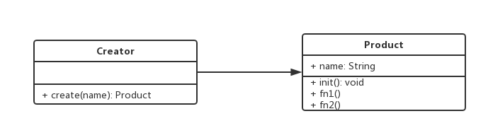

# 介绍

工厂，不经让我联想到工厂的生产流水线，既然是工厂，那就可以产出体量大、相似度高的商品。对于编程，就是创造对象（生产商品），创造（生产）出来的对象（商品）功能相同（都是一个模样）。

# 特征
- 不暴露创建对象的具体逻辑，将逻辑封装在一个函数中（我们只能远远看着一座工厂，除非你是这个厂）；
- 将 `new` 操作单独；
- 遇到 `new` 时，就要考虑是否该使用工厂模式；


# 分类

不暴露创建对象的具体逻辑，而是将将逻辑封装在一个函数中，那么这个函数就可以被视为一个工厂。

工厂模式根据抽象程度可以分为：简单工厂，工厂方法和抽象工厂。


- 简单工厂模式：也可以叫静态工厂模式，用一个工厂对象创建同一类对象的示例。
- 工厂方法模式
- 抽象工厂模式

## 简单工厂模式
我们都知道《红楼梦》是一种乌托邦，而《金瓶梅》才是真正的烟火生活。现实生活中，用户在平台还是分等级的，权限不同，享受的体验也是不同的。

```javascript
// 0.0.2/sample.factory.js
// 简单工厂模式
class Repo {
    constructor(permissions) {
        this.permissions = permissions;
    }

    static create(role) {
        switch (role) {
            case 'owner':
                return new Repo(['set', 'del', 'move', 'manage', 'create', 'develop', 'commit', 'push', 'clone', 'issue', 'comment']);
                break;
            case 'developer':
                return new Repo(['develop', 'commit', 'push', 'clone', 'issue', 'comment']);
                break;
            case 'guest':
                return new Repo(['issue', 'comment']);
                break;
            default:
                throw new Error('参数错误，可选参数：owner、developer、guest');
        }
    }

    showPermissions() {
        const value = this.permissions.join(', ');
        console.log(`\n 角色 ${this.permissions}       \n => ${value}`);
    }
}

let owner = Repo.create('owner');
owner.showPermissions();

let developer = Repo.create('developer');
developer.showPermissions();

let guest = Repo.create('guest');
guest.showPermissions();
```

上例中，`Repo` 就是一个简单工厂，3个实例对应不同的权限，调用工厂函数时，只需传递 `owner、master、developer、reporter、guest` 就可获取对应的实例对象。

1.简单工厂函数适用场景
- 正确传参，就可以获取所需要的对象，无需知道内部实现细节；
- 内部逻辑（工厂函数）通过传入参数判断实例化还是使用哪些类；
- 创建对象数量少（稳定），对象的创建逻辑不复杂；

2.简单工厂函数不适用场景
- 当需要添加新的类时，就需要修改工厂方法，这违背了开放封闭原则（OCP, 对扩展开放、对源码修改封闭）。正所谓成也萧何败也萧何。函数 `getInstance` 内包含了所有创建对象（构造函数）的判断逻辑代码，如果要增加新的构造函数还需要修改函数 `getInstance`（判断逻辑代码），当可选参数 `role` 变得更多时，那函数 `getInstance` 的判断逻辑代码就变得臃肿起来，难以维护。
- 不适用创建多类对象；

## 工厂方法模式
基于简单工厂模式的不适用场景，**工厂方法模式将实际创建的对象逻辑拿到子类中实现，不在工厂方法中进行**。这样添加新的类时就无需修改工厂方法，只需要将子类注册进工厂方法的原型对象中即可。

```javascript
// 0.0.2/function.factory.js
// 工厂模式方法
class RepoBase { // 抽象类
    constructor(permissions) {
      if (new.target === RepoBase) {
          throw new Error('抽象类不能实例');
      }
      this.permissions = permissions;
    }
}

class Repo extends RepoBase { // 子类
    constructor(permissions) {
        super(permissions);
    }
    create(role) {
        switch (role) {
            case 'owner':
                return new Repo(['set', 'del', 'move', 'manage', 'create', 'develop', 'commit', 'push', 'clone', 'issue', 'comment']);
                break;
            case 'developer':
                return new Repo(['develop', 'commit', 'push', 'clone', 'issue', 'comment']);
                break;
            case 'guest':
                return new Repo(['issue', 'comment']);
                break;
            default:
                throw new Error('参数错误，可选参数：owner、developer、guest');
        }
    }

    showPermissions() {
        const value = this.permissions.join(', ');
        console.log(`\n 角色 ${this.permissions}       \n => ${value}`);
    }
}


// let repoBase = new RepoBase(); // 此行会报错，注释后方可正常执行后面

let repo = new Repo();

let owner = repo.create('owner');
owner.showPermissions();

let developer = repo.create('developer');
developer.showPermissions();

let guest = repo.create('guest');
guest.showPermissions();
```

由于 ES6 中还没有 `abstract`，就用 `new.target` 来模拟出抽象类（`new.target` 指向被 `new` 执行的构造函数），判断 `new.target` 是否指向了抽象类，如果是就报错。

```javascript
// 0.0.2/es5.function.factory.js
// 工厂模式方法 es5
function Repo(permissions){
    if(this instanceof Repo){
        return this[permissions](permissions);
    }
    return new Repo();
}
Repo.prototype.owner = function(permissions){
    var permissions = ['set', 'del', 'move', 'manage', 'create', 'develop', 'commit', 'push', 'clone', 'issue', 'comment'];
    var value = permissions.join(', ');
    console.log(`\n 角色 ${permissions}       \n => ${value}`);
}
Repo.prototype.developer = function(permissions){
    var permissions = ['develop', 'commit', 'push', 'clone', 'issue', 'comment'];
    var value = permissions.join(', ');
    console.log(`\n 角色 ${permissions}       \n => ${value}`);
}
Repo.prototype.guest = function(permissions){
    var permissions = ['issue', 'comment'];
    var value = permissions.join(', ');
    console.log(`\n 角色 ${permissions}       \n => ${value}`);
}

var owner = new Repo('owner');
var developer = new Repo('developer');
var guest = new Repo('guest');
```

当需要添加新类时，只需挂载在 `Repo.prototype` 上，无需修改工厂方法，也实现了 OCP 原则。


## 抽象工厂模式
主要用于对**产品类簇**的创建，而不是直接生成实例（简单工厂模式和工厂方法模式都是生成实例）。


# UML 类图




# 编码
```javascript
// 0.0.2/factory.js
class Creator {
  constructor(name) {
    this.name = name
  }
  init() {
    console.log(this.name)
  }
  fn1() {
    console.log('fn1')
  }
  fn2() {
    console.log('fn2')
  }
}

class Factory {
  create(name) {
    return new Creator(name)
  }
}

// 测试
let factory = new Factory();
let f1 = factory.create('f1');
f1.init()
f1.fn1()

console.log('---分割线---')
let f2 = factory.create('f2');
f2.init()
f2.fn1()
```

# 场景
1.jQuery源码-工厂模式
```javascript
// 0.0.2/jquery.factory.js
// 工厂模式
class jQuery {
  constructor(selector) {
    let slice = Array.prototype.slice;
    let dom = slice.call(document.querySelectorAll(selector));
    let len = dom ? dom.length : 0;
    for (let i = 0; i < len; i++) {
      this[i] = dom[i];
    }
    this.length = len
    this.selector = selector || ''
  }
  addClass(name) {
    console.log(name)
  }
  html(data) {

  }
  // 省略多个 API
}

// 工厂模式
window.$ = function(selector) {
  return new jQuery(selector);
}

// 实例
const $li = $('li') 
$li.addClass('item');
```

2.`React.createElement` 实现
```javascript
// jsx
var profile = (
  <div>
    
    <h3>{[user.firstName, user.lastName].join(' ')}</h3>
  </div>
);

// 实现
var profile = React.createElement('div', null, 
  React.createElement('img', { src: 'https://raw.githubusercontent.com/ruizhengyun/images/master/cover/ruizhengyun.cn_.png', className: 'profile' }),
  React.createElement('h3', null, [user.firstName, user.lastName].join(' '))
);

// 源码
class Vnode(tag, attrs, children) {
  // ...
}

React.createElement = function(tag, attrs, children) {
  return new Vnode(tag, attrs, children);
}
```

# 设计原则验证
- 构造函数与创建者分离
- 符合开放封闭原则


# 阅读源码（lib）意义
- 学习如何实现功能（招式）
- 学习设计思路（心法）
- 刻意模拟学习
- 写出愉悦的代码


# 你可以...

[上一篇：Javascript 设计模式之设计原则](./rule.html)

[下一篇：Javascript 设计模式之单例模式](./single.html)