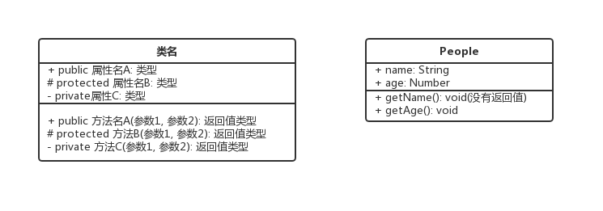
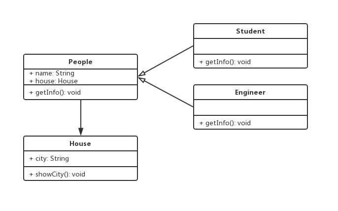

# 为什么要写 Javascript 设计模式小书
关于 Javascript 设计模式的文章与书有很多很多，我写这小书主要记录我的学习过程中的笔记和心得，便于自己查看，当然也想分享给走在前端路上的小伙伴（如果能帮到你一二，那也是极好的）。

小书中的每篇的篇幅都不是很长（单篇知识肯定没讲透），只是尽所能使其简单和让自己整明白各个模式是怎么一回事（如果也有让你整明白，那就更好了）。

来吧，

# 为什么要学设计（模式）
- 3 年工作经验，面试必考;
- 成为项目技术负责人，设计能力是必要基础;
- 从写好代码，到做好设计，设计模式是必经之路;


# 现实问题
- 网站资料针对 java 等后端语言比较多;
- 看懂概念，不知道怎么用，看完就忘;
- 现在的js框架（react、vue等），都用了哪些设计模式;


# 搭建开发环境
## 准备工作

```nodejs
# 项目初始化
npm init -y

# 新建开发目录src
mkdir src

# 安装webpack
npm install webpack-cli webpack --save-dev

# 安装babel
npm install babel-loader babel-core babel-preset-env html-webpack-plugin babel-plugin-transform-decorators-legacy -D

# 安装开发服务环境
npm install webpack-dev-server -D

# 新建配置webpack
touch webpack.dev.config.js
```

## 编写 `webpack.dev.config.js`

```javascript
const path = require('path')
const HtmlWebpackPlugin = require('html-webpack-plugin')

module.exports = {
    entry: './src/index.js',
    output: {
        path: __dirname,
        filename: './release/bundle.js'  // release 会自动创建
    },
    plugins: [
        new HtmlWebpackPlugin({
            template: './index.html'  // bundle.js 会自动注入
        })
    ],
    devServer: {
        contentBase: path.join(__dirname, './release'),  // 根目录
        open: true,  // 自动打开浏览器
        port: 3000,   // 端口
        historyApiFallback: true
    },
    module: {
        rules: [
            {
              test: /\.js?$/,
              exclude: /(node_modules)/,
              loader: 'babel-loader'
            }
        ]
    }
}
```

## 编辑 `package.json`，在 `script` 添加 `dev` 任务

```javascript
{
  ...,
  "scripts": {
    ...,
    "dev": "webpack --config ./webpack.dev.config.js --mode development"
  },
  ...
}
```


# 面向对象

## 为什么使用面向对象

- 程序的执行离不开 **顺序、判断、循环** 操作，也就是将其结构化;
- 面向对象就是将零散的数据结构化;
- 对于计算机而言，结构化的才是最简单的（松本行弘的程序世界）;
- 编程应该是**简单&抽象，简单的前提是抽象，抽象后才简单**;

> 关于抽象：抽取事物的共同特征就是抽取事物的本质特征，舍弃非本质的特征。所以抽象的过程也是一个裁剪的过程。在抽象时，同与不同，决定于从什么角度上来抽象。抽象的角度取决于分析问题的目的。

## 面向对象三要素

- 继承：子类继承父类（用的多）;
- 封装：数据的权限和保密（将对象里面的某些属性和方法不想让别人看见。ES6 尚不支持，可用 typescript 演示）;
- 多态：同一接口不同实现，简单来讲就是父类定义一个接口，子类实现不同的功能;

## 继承

```javascript
// 0.0.1/01.js
// 类，即模板
class People {
    constructor(name, age) {
        this.name = name
        this.age = age
    }
    getName() {
        console.log(`名字: ${this.name}`)
    }
    getAge() {
        console.log(`年龄: ${this.age}`)
    }
}

// 创建实例
const zhang = new People('张三', 27);
zhang.getName();
zhang.getAge();

// 创建实例
const li = new People('李四', 22);
li.getName();
li.getAge();

// 子类继承父类
class Student extends People {
    constructor(name, age, id) {
        super(name, age)
        this.id = id
    }
    getId() {
        console.log(`${this.name}，年龄 ${this.age}，学号 ${this.id}`)
    }
}

// 创建实例
const wang = new Student('王五', 22, '001')
wang.getId();
```

总结：
- `People` 是父类，公共的，不仅仅服务于 `Student`;
- 可将公共方法抽离出来，提高复用，减少冗余（这是软件设计最基础和最高效的方式）;


## 封装

```javascript
// 0.0.1/02.js
// 封装 public-开放   protected-对子类开放   private-对自己开放
// 在线编译地址 => http://www.typescriptlang.org/play/ 
// 父类
class People {
    public name
    age
    protected weight // 受保护属性，只有自己或子类可用

    constructor(name, age) {
        this.name = name
        this.age = age
        this.weight = 120
    }
    getName() {
        console.log(`名字: ${this.name}`)
    }
    getAge() {
        console.log(`年龄: ${this.age}`)
    }
}

// 继承
class Student extends People {
    id
    private girlFriend
    constructor(name, age, id) {
        super(name, age)
        this.id = id
        this.girlFriend = '赵雪'
    }
    getId() {
        console.log(`${this.name}，年龄 ${this.age}，学号 ${this.id}`)
    }
    getWeight() {
        console.log(`${this.weight}`)
    }
}

const xm = new Student('小明', 24, '002');
xm.getWeight();
// console.log(xm.girlFriend);
```

说明

- `public` 完全开发；
- `portected` 对子类开放；
- `private` 对自己开放(ES6 尚不支持，可用 typescript 演示)；

总结
- 较少耦合，不该外露的不外露
- 利于数据、接口的权限管理
- ES6目前不支持，一般认为 _开头的属性是 private ，比如var _num = 20


## 多态
```javascript
// 0.0.1/03.js
class People {
    constructor(name, age) {
        this.name = name
        this.age = age
    }
    getName() {
        console.log(`名字: ${this.name}`)
    }
    getAge() {
        console.log(`年龄: ${this.age}`)
    }
}

class A extends People {
    constructor(name) {
        super(name)
    }
    getName() {
        console.log(`A名字: ${this.name}`)
    }
}

class B extends People {
    constructor(name) {
        super(name)
    }
    getName() {
        console.log(`B名字: ${this.name}`)
    }
}

// 创建实例
const p1 = new People('p1')
p1.getName();

const a1 = new A('a1')
a1.getName();

// 创建实例
const b1 = new B('b1')
b1.getName();
```

总结
- 保持子类的开放性和灵活性;
- 面向接口编程(不用管子类如何实现，就看父类有多少接口) ;  
- js 应用极少;
- 需要结合 java 等语言的接口、重写、重载等功能;

# 应用举例

## 以 jQuery 为例

```javascript
// 0.0.1/04.js
class jQuery {
  constructor(selector) {
    let slice = Array.prototype.slice;
    let dom = slice.call(document.querySelectorAll(selector));
    let len = dom ? dom.length : 0;
    for (let i = 0; i < len; i++) {
      this[i] = dom[i];
    }
    this.length = len
    this.selector = selector || ''
  }
  append(node) {
    // ....
  }
  addClass(name) {
    // ....
  }
  html(data) {
    // ....
  }
  // 省略多个 API
}

window.$ = function(selector) {
  // 工厂模式
  return new jQuery(selector);
}

const $li = $('li') 
console.log($li);
console.log($li.addClass);
```

# UML类图

UML，统一建模语言（Unified Modeling Language）。类图描述的是一种静态关系，在系统的整个生命周期都是有效的，是面向对象系统的建模中最常见的图，展现了一组对象、接口、协作和它们之间的关系。关系是指泛化（继承）和关联（引用）。

## 画图工具（工欲上其事必先利其器）
- MS Office visio;
- [processon](https://www.processon.com/)（不是会员有数量限制）;
- Gliffy Digrams（chrome 应用插件，不过没有数量限制）;

## 举例：一个简单类


```javascript
class People {
  constructor(name, age) {
    this.name = name
    this.age = age
  }
  getName() {
    console.log(`名字: ${this.name}`)
  }
  getAge() {
    console.log(`年龄: ${this.age}`)
  }
}
```

## 举例：继承与引用



```javascript
// 0.0.1/05.js
class House {
    constructor(city) {
        this.city = city;
    }
    showCity() {
        console.log(`城市：${this.city}`)
    }
}

class People {
    constructor(name, house) {
        this.name = name
        this.house = house
    }
    getInfo() {
        console.log(`我是${this.name}，有房在【${this.house.city}】`)
    }
}

class Student extends People {
    constructor(name, house) {
        super(name, house)
    }
    getInfo() {
        console.log(`我是${this.name}，一名学生，有房在【${this.house.city}】`)
    }
}

class Engineer extends People {
    constructor(name, house) {
        super(name, house)
    }
    getInfo() {
        console.log(`我是${this.name}，一名工程师，有房在【${this.house.city}】`)
    }
}

// 实例化
const h1 = new House('杭州');
const p1 = new People('张三', h1)
p1.getInfo();

const s1 = new Student('李四', h1)
s1.getInfo();

const e1 = new Engineer('王五', h1)
e1.getInfo();
```

# 你可以...

[下一篇：Javascript 设计模式之设计原则](./rule.md)