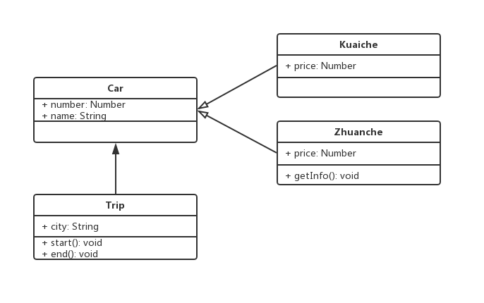

# 关于设计
- 按照哪一种思路或标准来实现功能；
- 功能相同，可以有不同的设计方案来实现；
- 伴随需求增加，设计作用才体现出来（版本迭代，需求变化）；

# 设计哲学（Unix/Linux）
- 小即是美；
- 让每个程序做好一件事；
- 让每个程序都称为过滤器（`gulp的pipe、webpack的loader`）；
- 快速建立原型（快速发布，获取用户需求，再迭代）;
- 舍弃高效率而取可移值性（取舍，宁可放弃效率高的也要选择可复用的）;
- 采用纯文本来存储数据（取舍，宁可放弃便于计算机阅读的方式也要选择方便人读的格式）;
- 充分利用软件的杠杆效应（软件复用）;
- 使用shell脚本来提高杠杆效应和移值性;
- 避免强制性的用户界面（使用命令行，高效）（用户界面占用内存，也会存在安全问题）;

## 小准则
- 允许用户定制环境；
- 尽量使操作系统内核小而轻量化（包含最核心的API，内核是内核，工具是工具，插件是插件）；
- 使用小写字母并尽量简单（list - ls）；
- 沉默是金（没有就不输出）；
- 各部分之和大于整体（部分之间不影响）；
- 寻求90%的解决方案（28 定律：20% 成本解决 80% 的需求，剩下 20% 的需求想要解决需要花更多时间不值得去做）；

1.演示：沉默是金 + 让每个程序都称为过滤器
```node
ls
ls | grep .json
ls | grep .json | grep 'package' // package.json
ls | grep .json | grep 'package1' // 什么都不显示（沉默是金）
```

# 五大设计原则-SOLID
- S(single)-单一职责原则- 一个程序只做好一件事；如果功能过于复杂就拆分开，每个部分保持独立；
- O(open-close)-开放封闭原则- 对扩展开放，对修改封闭；增加需求时，扩展新代码，而非修改已有代码；
- L(Liskov)-里氏置换原则-子类能覆盖父类；父类能出现的地方子类就能出现；
- I(Interface)-接口独立原则-保持接口的单一独立，避免出现”胖接口“；js中没有接口（typescript除外），使用少；
- D(Dependence)-依赖倒置原则-编程依赖抽象接口，不要依赖具体实现；使用方只关注接口而不关注具体类的实现；

## 示例 promise
- 单一职责原则：每个 then 中的逻辑制作好一件事
- 开放封闭原则：如果新增需求，扩展 `then`

```javascript
// 0.0.1/loadImg.js
function loadImg(src) {
    let promise = new Promise(function (resolve, reject) {
        let img = document.createElement('img');
        img.onload = function () {
            resolve(img);
        }
        img.onerror = function () {
            reject('图片加载失败');
        }
        img.src = src;
    });
    return promise;
}

let imgUrl = 'https://raw.githubusercontent.com/ruizhengyun/images/master/cover/ruizhengyun.cn_.png';
loadImg(imgUrl).then(function (img) {
    console.log(`width: ${img.width}`);
    return img;
}).then(function (img) {
    console.log(`height: ${img.height}`);
}).catch(function (ex) {
    console.log(ex);
});
```

# 设计到模式（设计是设计，模式是模式）
- 设计-原则-思路-心法；
- 模式-模板-做事-招式；


# 如何学设计模式
- 明白设计的用意；
- 通过经典应用体会它的整正使用场景；
- 自己编码时多思考，多模仿（刻意训练）；


# 面试题
## 示例1：打车
1.需求
- 打车时，可以打专车或快车。任何车都有车牌号和名称
- 不同车价格不同，快车每公里1元，专车每公里2元
- 行程开始时，显示车辆信息
- 行程结束时，显示打车余额（假定行程为5公里）

2.UML类图



3.编码
```javascript
// 0.0.1/car.js
class Car {
  constructor(num, name) {
    this.num = num
    this.name = name
  }
}

class Kuaiche extends Car {
  constructor(num, name, price) {
    super(num, name)
    this.price = price
  }
}

class Zhuanche extends Car {
  constructor(num, name, price) {
    super(num, name)
    this.price = price
  }
}

class Trip {
  constructor(car){
    this.car = car
  }
  start() {
    console.log(`行程开始，名称${this.car.name}，车牌号：${this.car.num}`)
  }
  end() {
    console.log(`行程结束，价格：${this.car.price * 5}`)
  }
}

// 实例
let k1 = new Kuaiche('浙A Z1001', '大众', 1);
let t1 = new Trip(k1);
t1.start();
t1.end();

console.log('---------')
let z1 = new Zhuanche('浙A Z0001', '奔驰', 3);
let t2 = new Trip(z1);
t2.start();
t2.end();
```


## 示例2：停车

1.需求
- 某停车场，分3层，每层100车位
- 每个车位都能监控到车辆的驶入与离开
- 车辆驶入前，显示每层的空余车位数量
- 车辆驶入时，摄像头可识别车牌号和时间
- 车辆离开时，出口显示器显示车牌号和停车时长

2.UML类图


3.编码
```javascript
// 0.0.1/park-car.js
const random = (start, end) => {
  return Math.floor(Math.random() * (end - start + 1)) + start;
}

const timestampToTime = timestamp => {
  const date = new Date(timestamp);
  const Y = date.getFullYear() + '-';
  const month = date.getMonth() + 1;
  const M = (month < 10 ? ('0' + month) : month) + '-';
  const D = date.getDate() + ' ';
  const h = date.getHours() + ':';
  const m = date.getMinutes() + ':';
  const s = date.getSeconds();

  return Y + M + D + h + m + s;
}

// 车
class Car {
  constructor(num) {
    this.num = num
  }
}

// 摄像头
class Camera {
  shot(car) {
    return {
      num: car.num,
      inTime: Date.now()
    }
  }
}

// 出口显示屏
class Screen {
  show(car, inTime) {
    console.log(`车牌号 ${car.num}，停车时间 ${Date.now() - inTime} 毫秒`);
  }
}

// 停车场
class Park {
  constructor(floors) {
    this.floors = floors || []
    this.camera = new Camera()
    this.screen = new Screen()
    this.carList = {} // 存储摄像头拍摄返回的车辆信息
  }

  in(car) {
    // 通过摄像头获取信息
    const info = this.camera.shot(car);
    const i = random(1, 100);
    const j = random(1, 3);
    const place = this.floors[j].places[i]; // 第0层某个随机车位
    place.in()
    info.place = place
    // 记录某车牌的信息
    this.carList[car.num] = info; // { num, inTime, place }
    // console.log(`车牌号${info.num} 在 ${timestampToTime(info.inTime)} 驶入`);
  }

  out(car) {
    // 获取信息
    const { place, inTime } = this.carList[car.num];
    place.out()
    // 显示时间
    this.screen.show(car, inTime);
    // console.log(`车牌号${car.num} 在 ${timestampToTime(Date.now())} 驶出`);
    // 清空记录
    delete this.carList[car.num];
  }

  emptyFloorsNum() { // 计算每层车位剩余多少
    return this.floors
      .map(floor => `${floor.index} 层还有 ${floor.emptyPlacesNum()} 个空车位`)
      .join('\n')
  }
}

// 层
class Floor {
  constructor(index, places) {
    this.index = index
    this.places = places || []
  }

  emptyPlacesNum() { // 计算每层车位剩余多少
    let num = 0
    this.places.forEach(place => {
      if (place.empty) {
        num += 1
      }
    });
    return num
  }
}

// 车位
class Place {
  constructor() {
    this.empty = true
  }

  in() {
    this.empty = false
  }

  out() {
    this.empty = true
  }
}


// 测试-----------
// 初始化停车场
const floors = [];
for (let i = 1; i < 4; i++) {
  const places = []
  for (let j = 1; j < 101; j++) {
    places[j] = new Place()
  }
  floors[i] = new Floor(i, places)
}
const park = new Park(floors);


// 初始化车辆
const car1 = new Car(1001);
const car2 = new Car(1002);
const car3 = new Car(1003);

console.log('第1辆车进入，当前停车库停车情况');
console.log(park.emptyFloorsNum());
park.in(car1);
console.log('第2辆车进入，当前停车库停车情况');
console.log(park.emptyFloorsNum());
park.in(car2);

console.log('第1辆车离开');
park.out(car1);
console.log('第2辆车离开');
park.out(car2);

console.log('第3辆车进入，当前停车库停车情况')
console.log(park.emptyFloorsNum());
park.in(car3);
console.log('第3辆车离开');
park.out(car3);
```

[本次代码 Github](https://github.com/ruizhengyun/design-pattern-note/tree/feature_v0.0.1_20190722)

# 你可以...

[上一篇：Javascript 设计模式之面向对象与 UML 类图](./object_uml.md)

[下一篇：Javascript 设计模式之 23 种设计模式](./kind.md)